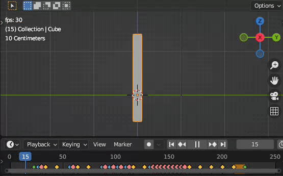

Hammer
======

This guide shows how to use :class:`bmusic.proc.Hammer` in common situations.

About
-----

The Hammer procedure animates the anticipation, hit, and recoil of a typical
hammer motion, along with handling the transitions between them.

Usage
-----

Define the AnimKey with the three movements.

- ``hit``: The hammer strikes the object, applied when a MIDI message starts.
- ``prepare``: Goes from resting to this a short time before hitting.
- ``recoil``: Does this after hitting. Additionally, oscillates between resting
  and this for a few iterations.

For example, this code controls the rotation.

.. code-block:: py

   from math import radians

   anim = bmusic.Animator(obj, "rotation_euler", 0)
   animkey = bmusic.Animkey([anim], [0])
   animkey["prepare"] = [-radians(45)]
   animkey["hit"] = [radians(30)]
   animkey["recoil"] = [-radians(40)]

----

Create the procedure, and customize it if necessary.

.. code-block:: py

   proc = bmusic.proc.Hammer(midi=midi, animkey=animkey)
   proc.animate()

   # Change time between rest and prepare
   Hammer(..., prepare_time=...)
   # Change time between prepare and hit
   Hammer(..., hit_time=...)
   # Change time between hit and recoil
   Hammer(..., recoil_time=...)
   # customize oscillations
   Hammer(..., osc_period=..., osc_count=..., osc_decay=...)
