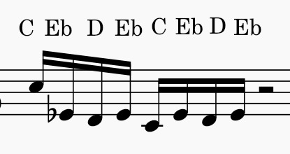

Binary Bach
===========

View the full animation here:
https://www.youtube.com/watch?v=ZE92NEA41nw

Prelude in C minor. An interesting piece. While practicing it, one cannot help but notice
an interesting pattern. Is there some deeper structure at play?

From Music to Binary
--------------------

Consider this section of eight 16th notes. The first half of the piece follows this pattern;
pianists often accent the first note in these groups a bit to emphasize this.

Here, I have annotated the section with the note names. Let's make a substitution: Replace:

.. code-block:: none

   C  --> d
   Eb --> a
   D  --> b
   C  --> c   (this one is the lower (second) C)

If we do this for each of the notes, we get the string ``dabacaba``. Sound familiar?
Some of you may recognize this in other contexts. It is also the solution to the Tower of
Hanoi problem. It is also Rondo form in classical pieces.

This is actually, as Grant Sanderson from 3Blue1Brown explains in his video, the "rhythm
of counting" in binary.

https://youtu.be/2SUvWfNJSsM?t=140

Regarding our example, consider when I count in binary:

.. code-block:: none

   7      0 1 1 1
   8      1 0 0 0
   9      1 0 0 1
   10     1 0 1 0
   11     1 0 1 1
   12     1 1 0 0
   13     1 1 0 1
   14     1 1 1 0
   15     1 1 1 1
          _______

          d c b a

Here, we count starting from 7. Consider the *highest* bit that changes with each iteration.

- From 7 to 8, for example, all the bits change, and the highest position is the leftmost place.
- From 8 to 9, only the rightmost bit changes.

Do this for each iteration, starting from 7 to 8.

Now, map the position of that bit to the note, which I included at the bottom of the table.
You get:

``dabacaba``

The exact same pattern.

Mapping ``a, b, c, d`` back to the notes, we obtain the original set of 8 notes.

So, each section in Bach's Prelude follows the rhythm of binary counting.

Animation
---------

The MIDI for this animation was actually computer generated, which is why it is so even and
consistent.

Animation of everything was done with scripting, using this library. You can view the scripts
in the ``examples`` folder.
