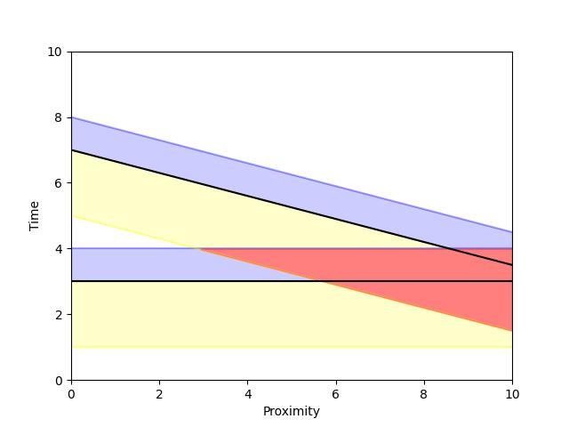
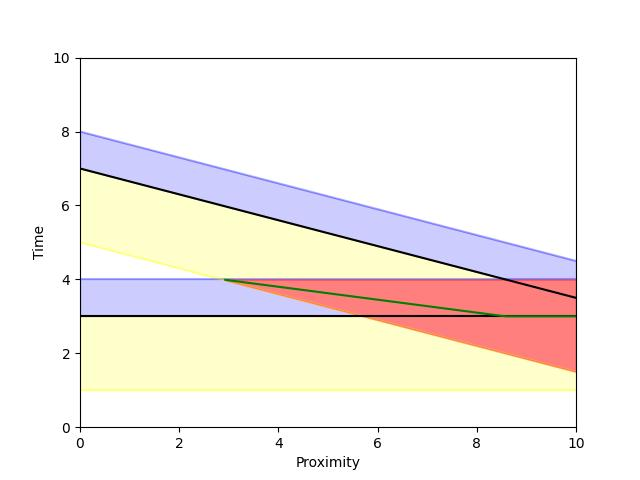
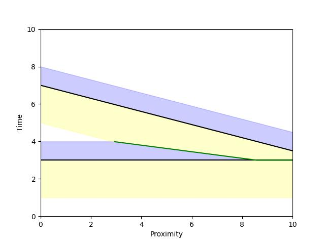

Affixes
=======

BMusic has utilities to compute *affixes* for each message in a track, described
below.

What are affixes?
-----------------

Most of the time in animations, we animate many frames around a message.
For example, a hammer may anticipate the hit by moving back *before* the hit,
and recoil *after*.

If we only have a single message (or messages very far apart), this is simple:
Just hard-code the movements and paste them where the message appears.

But, if we have many messages close to each other, the keyframes may overlap:
There might not be enough time between two messages for the hammer to recoil and
anticipate completely.

The solution is to check the proximity of the messages immediately before and
after our current message. We then adjust (e.g. shorten the motion) to avoid the
overlap.

This is common enough that BMusic provides tools to compute how much time is
available before and after each message.

These are called *affixes*: The *prefix* is the time before, and the *suffix* is
after.

How affixes are computed
------------------------

The :func:`bmusic.compute_affixes` function takes in a few notable parameters:

- ``max_prefix``: Max duration of the prefix.
- ``max_suffix``: Max duration of the suffix.
- ``split``: Explained below.

The main complexity is in dealing with overlaps. Different applications may
require different ways of choosing which affix to shorten.

For example:

For a hammer, it would be ideal to shorten the two equally: If we have a short
period of time between two messages, the hammer should both recoil and
anticipate quickly.

For a glow-fade (where the prefix is quickly getting to the peak brightness, and
the long suffix is fading away), we want to only shorten the suffix: If there is
overlap, we want to keep the full prefix (which is relatively short) of lighting
up, while cutting the suffix a bit short.

This is set by the ``split`` parameter.

For a given overlap, the new splitting point is computed using ``split``. The
splitting point is clamped to be between the original messages.

----

Consider these illustrations:

Imagine we have two messages, represented in black. In yellow is the prefix, and
blue is the suffix.

The X axis shows how close the messages are to each other, and illustrates how
the splitting system works as the messages get closer.

The Y axis is a slice of the resulting timeline.

Notice how on the left (small values of x), the messages are far apart. If we
consider the vertical slice, for example, at x=1, the messages can have their
full prefix and suffix.

But on the right side, they overlap. For example, at x=4, the red region shows
where they overlap.

At the more extreme end, x=9, they are so close that the top message (in black)
falls inside the first message's suffix (the blue/red region).

We solve this problem by calculating a split point, in green. In this example,
split=0.5, meaning the split point is halfway between the overlap.

Areas under the split become the shortened suffix of one message, and above is
the shortened prefix of the other.

Notice how the split is clamped to be between the original messages, shown when
it flattens as it touches the bottom message. This means that the bottom
message's suffix completely disappears.

Here, the final result is shown. When the messages don't overlap, they have
their normal affixes. When they do overlap, the split line is used.

BMusic API
----------

The :class:`bmusic.AffixMessage` class extends :class:`bmusic.Message` with two
new fields: ``prefix`` and ``suffix``.

Compute affixes for a track with :func:`bmusic.compute_affixes`.

.. code-block:: python

   affixes = bmusic.compute_affixes(midi)
   for msg in affixes:
       # msg is an AffixMessage, which is a subclass of Message.
       print(msg)
       print("Prefix:", msg.prefix)
       print("Suffix:", msg.suffix)
