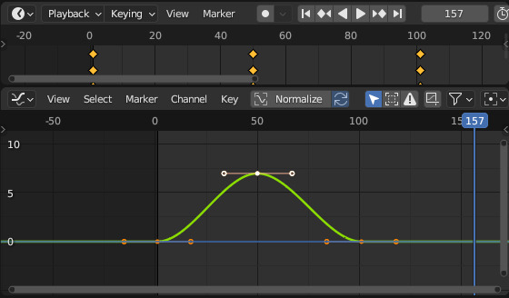
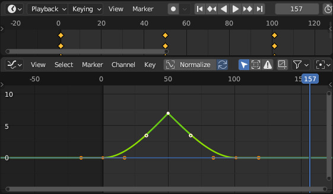
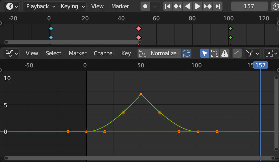

.. _animator:

Animator
========

The :class:`~bmusic.Animator` class is a **wrapper** around Blender's
**animation API**.

Quickstart
----------

.. code-block:: python

   import bmusic
   import bpy

   obj = bpy.context.object   # Make sure Cube is the active obj

   animator = bmusic.Animator(obj, "location", 2)
   animator.animate(frame=0, value=0)
   animator.animate(30, 1, handle="VECTOR")
   animator.animate(60, 0, type="EXTREME")

About
-----

The :class:`~bmusic.Animator` class provides an interface to Blender's fcurve
animation API. It does not add many features, but is easier to use.

The Animator allows you to:

- Control a single animation channel, including the index of a vector property.
    - e.g. ``pass_index``, ``location[0]``, ``rotation_euler[2]``.
- Insert keyframes.
    - Set the handle type
    - Set the keyframe type.

Keyframes
---------

Blender uses
`Keyframes <https://docs.blender.org/manual/en/latest/animation/keyframes/index.html>`_
to do animation.

Keyframes set the *value* of a property at a certain *frame*.

Blender automatically interpolates between two keyframes to create a smooth
transition.

For example, if you have two keyframes on frames 0 and 100 (and no keyframes in
between), Blender will smoothly transition the value from the first to the
second over the course of the 100 frames.

This removes the need to set a value for every frame. Instead, set the extremes,
and Blender will fill in the rest.

Keyframes can be thought of as containing the following information:

- Frame: When in time the keyframe occurs.
- Value: The value of the property (e.g. location) at that frame.
- Handle: How the curve is interpolated between this keyframe and the next.
- Type: An organizational tag for the keyframe.

Handle
^^^^^^

Blender represents keyframes as bezier curves. Each keyframe has a *handle type*
that affects interpolation.

In Blender's Graph Editor, you can extensively edit keyframes as bezier curves,
allowing very fine control over the interpolation.

In BMusic, however, we only change the keyframe handle type, due to the
complexity of editing a bezier curve through code. Naturally, this restricts the
amount of fine control we have over the interpolation.

The two most common handle types are ``AUTO_CLAMPED`` and ``VECTOR``.

``AUTO_CLAMPED`` is the default. It will smoothly transition between the
previous and next keyframes, speeding up in the middle and slowing down at the
edges.

``VECTOR`` will have a sharp stop and start around the keyframe. This is useful
when you're animating a sharp motion, such as when a hammer strikes the strings.

Type
^^^^

The type is an *organizational* tag for the keyframe. It changes only the
appearance of the keyframe in Blender's interface; the keyframe's function is
not affected.

The five types are:

- ``KEYFRAME``: Yellow. The default type.
- ``BREAKDOWN``: Blue and small.
- ``MOVING_HOLD``: Looks like ``KEYFRAME``.
- ``EXTREME``: Red and large.
- ``JITTER``: Green and small.

The BMusic builtin animation algorithms will set the types to make it easier to
see what's going on. For example, each keyframe corresponding to the hammer
striking will be ``EXTREME``.

Using it
--------

An Animator controls a single fcurve of an object.

To create the Animator, first define:

- The object to animate.
- The fcurve *name*. For example, ``location``, ``rotation_euler``, ``scale``,
  ``pass_index``.
- Optionally, the fcurve *index*. For example, ``0`` for X, ``1`` for Y, ``2``
  for Z.

    - For scalar (non-vector) properties (e.g. ``pass_index``), simply omit the
      index.

Then, create the Animator:

.. code-block:: python

   animator = bmusic.Animator(obj, name, index)
   # or
   animator = bmusic.Animator(obj, name)

   # Examples
   animator = bmusic.Animator(bpy.context.object, "rotation_euler", 2)
   animator = bmusic.Animator(bpy.data.objects["Object"], "pass_index")

Call the ``animate()`` method to insert a keyframe:

.. code-block:: python

   # Signature
   animator.animate(frame, value, handle="AUTO_CLAMPED", type="KEYFRAME")

   # Examples
   animator.animate(0, 0)
   animator.animate(30, 1, handle="VECTOR")
   animator.animate(60, 0, type="EXTREME")
