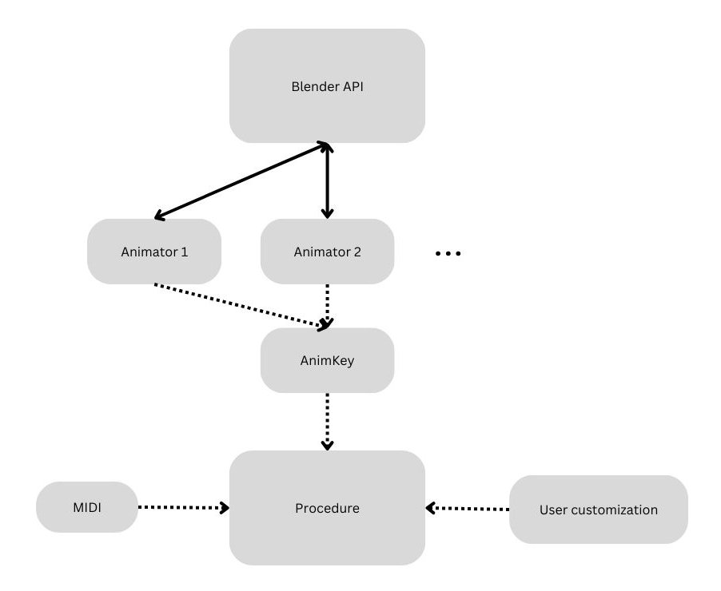

Overview
========

This flowchart shows the relationship between the main components of BMusic.

- Blender Python API:
  Allows Python scripts (e.g. the BMusic library) to interact with Blender.
- :ref:`animator`:
  Wrapper around Blender's animation API. Exposes functions to insert keyframes
  for one property (e.g. Z location).
- :ref:`animkey`:
  Abstracts multiple Animators into a single interface.
- :ref:`procedure`:
  An animation procedure for a specific purpose (e.g. a hammer motion).
  Uses AnimKey to insert keyframes.
- :ref:`midi-docs`:
  Music data from a MIDI file.
- User customization:
  Parameters defined by the Procedure.
