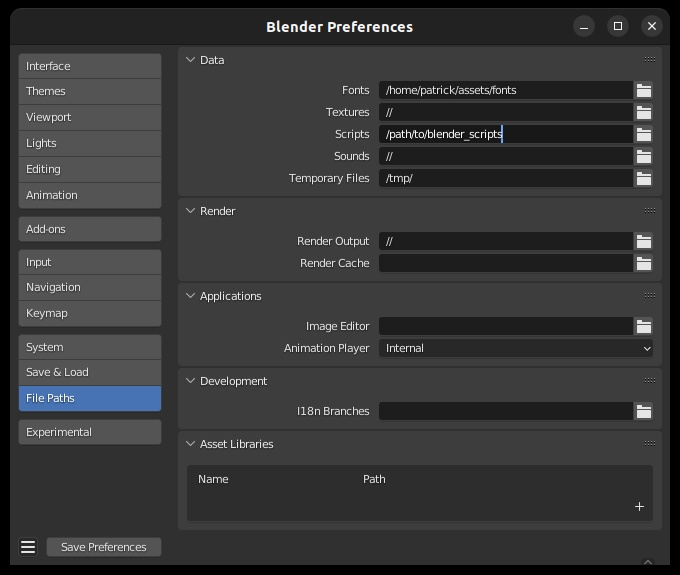
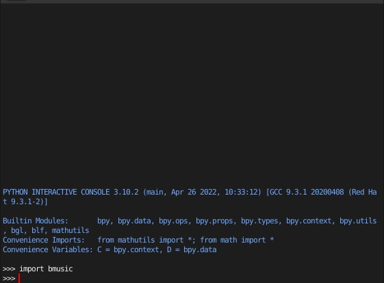

Installation
============

.. note::
   These instructions are for installing the BMusic library only. You may need
   other software in order to produce music animations.

BMusic is a Python library. Blender has a Python API which BMusic uses to
animate the objects. The installation process allows Blender Python to use
BMusic and it's dependencies.

First, you will need to choose a directory dedicated to Blender Python's
libraries. This directory is separate from the system Python's libraries.

Make the directories. Notice that we make an additional directory ``modules``
inside the chosen directory.

.. code-block:: bash

   mkdir -p /path/to/blender_scripts/modules

In Blender, go to "Preferences" > "File Paths" > "Scripts" and set the path to
the directory chosen (in this example, ``/path/to/blender_scripts``).

Next, we can install BMusic with ``pip``, but setting the install path to the
directory we created earlier. Make sure you have ``pip`` or ``pip3`` installed.

.. code-block:: bash

   pip install --target="/path/to/blender_scripts/modules" bmusic

This will install BMusic and all of its dependencies.

To check that the installation is correct, open a console in Blender and type
``import bmusic``. If nothing happens, the installation is correct.

