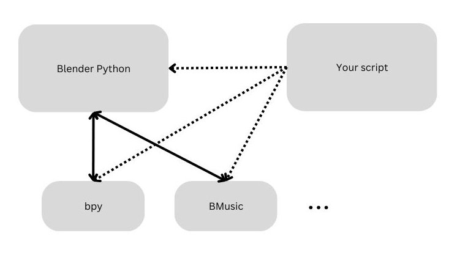

Installation
============

.. note::
   These instructions are for installing the BMusic library only. You may need
   other software in order to produce music animations.

Overview
--------

BMusic is a **Python library**, not an add-on.

The general workflow when using BMusic in a music animation is:

- Create a script in your Blender scene.
- ``import bmusic`` in the script, and use applicable BMusic features.
- Run the script in Blender.

Installing BMusic itself won't do any animation. For each project you create,
you need to create your own script(s), use BMusic functions if applicable, and
run the script in Blender.

About Blender Python
--------------------

Blender comes with a Python interpreter that is *separate from your system's
Python*.

This flowchart shows how various components interact.

- Blender Python has it's own modules (which we will modify later). Scripts that
  you run from Blender use this interpreter and those modules.
- Blender comes with the ``bpy`` module, which is the gateway between Blender
  and Python.
- Your script imports applicable modules (usually ``bpy``) and, again, runs on
  the Blender Python.

Installing
----------

If you have not already (most likely if you never touched scripting before),
choose a new, dedicated folder for the Blender Python libraries we will install.

- This is separate from the system Python's libraries.
- Place it somewhere where you won't touch for a while; if you modify the path,
  you also need to change it in Blender's preferences (see below).

----

Make the directories. Notice that we **make an additional directory** ``modules``
**inside the chosen directory**.

.. code-block:: bash

   mkdir -p /path/to/blender_scripts/modules

----

.. image:: ./BPrefsFilePath.jpg

In Blender, go to "Preferences" > "File Paths" > "Scripts" and set the path to
the directory chosen (in this example, ``/path/to/blender_scripts``). Notice how
we omit the subdirectory ``modules`` here.

----

Next, we can install BMusic with ``pip``, but setting the install path to the
directory we created earlier.

.. code-block:: bash

   pip install --target="/path/to/blender_scripts/modules" bmusic

This will install BMusic and all of its dependencies.

Confirmation
------------

To check that the installation is correct, open a console in Blender and type
``import bmusic``. If nothing happens, the installation is correct.

Troubleshooting
---------------

There is a known issue with numpy, possibly because Blender Python has numpy
already built in. If you run into this error, try installing BMusic and
dependencies *except* numpy.

These instructions reflect the required dependencies as of ``v0.1.1``.

First, **remove all files** in the ``modules`` directory so you can start over.

.. code-block:: bash

   rm -rf /path/to/blender_scripts/modules/*

   # Install BMusic with no dependencies.
   pip install --target="/path/to/blender_scripts/modules" bmusic --no-deps
   # Install dependencies manually, except numpy.
   pip install --target="/path/to/blender_scripts/modules" mido tqdm

