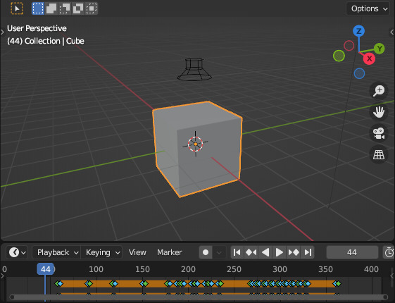

First Steps
===========

One note
--------

The first example uses a MIDI of a single note repeating.

#. Download :download:`../assets/OneNote.mid` and
   :download:`../assets/OneNote.mp3` for the tutorial.

Setup scene
^^^^^^^^^^^

#. Use any object as the thing to animate; e.g. the default cube.

#. Optionally, set the FPS to something higher than the default 24. I usually
   use 60, and set a frame interval if I want to render at 30.

#. Optionally, add a speaker and load the downloaded audio. Remember, the frame
   at which you add the speaker is when it will start playing. So remember what
   frame it was added, and we will use that later when animating. See
   :ref:`speaker` for more details.

   - Usually, we want some time before the animation starts, so consider adding
     the speaker at, say, frame 60.

#. Go to the ``Scripting`` screen layout. Add a new script in the text editor.

Code
^^^^

First, do the setup:

.. code-block:: python

   import bmusic
   import bpy

   obj = bpy.data.objects["Cube"]

Next, load the MIDI file. See :ref:`midi` for more details.

Make sure to set the ``offset`` to the frame at which the speaker was added.

.. code-block:: python

   # Set offset to the appropriate frame
   midi = bmusic.parse_midi("/path/to/OneNote.mid", offset=...)

Next, create the Animator instance. See :ref:`animator` and
:class:`bmusic.Animator` for more details.

.. code-block:: python

   # Create the Animator object on the cube's X location
   # The "0" is the index of the property; location is XYZ, so 0 is X.
   # For single element properties (like pass index), omit the last argument.
   anim = bmusic.Animator(obj, "location", 0)

Next, create the AnimKey instance. See :ref:`animkey` and
:class:`bmusic.AnimKey` for more details.

Here, we need to refer to the docs of our Procedure, which we use in the next
step.

For this example, we will use :class:`bmusic.proc.IntensityOnOff`. The class
docs tell us how to setup our :class:`bmusic.AnimKey`:

.. code-block:: python

   animkey = bmusic.AnimKey([anim], [0])
   animkey["on"] = [1]

Finally, create the procedure, and run it.

.. code-block:: python

   proc = bmusic.proc.IntensityOnOff(midi=midi, animkey=animkey)
   proc.animate()

Results
^^^^^^^

You should see keyframes in the timeline. Play the animation, and the cube
should move in sync with the music.

If applicable, increase the end frame so you can view the full animation.

