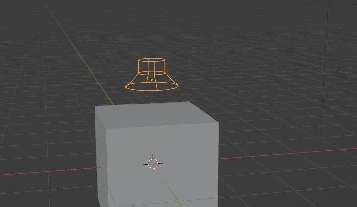

.. _speaker:

Blender Speakers
================

Blender has a speaker object, which is quite obscure to most. It can be quite
useful for music animations, adding sound when you preview your animation.

Usage is quite self explanatory: Add the speaker, select an audio file, and it
will play the audio along with your animation.

However, there are a few things to note:

- **Start frame**: The frame at which you add the speaker object (not select
  the audio file) is the frame when the audio will start.
- **Sound effects**: Blender will calculate pitch shifts from the doppler
  effect, volume based on distance, and panning. This is all relative to your
  active camera.

  - I usually set "Volume Min/Max" both to 1 in the properties to avoid this, as
    it's quite annoying.
  - I usually parent the speaker to the camera to avoid the doppler effect.

- **Final audio**: If you render the animation to a video file, the audio will
  be included (along with the above mentioned effects). However, I usually
  process the final audio separately, and then combine them in a video editor.
